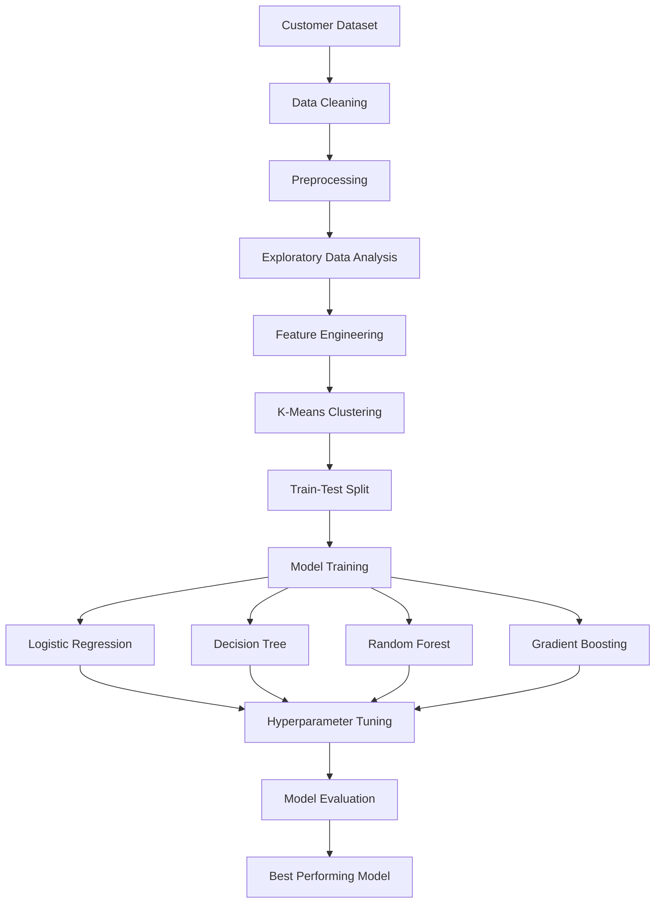

# 📉 Customer Churn Prediction using Machine Learning


---

# 📖 Overview

This project presents a complete machine learning pipeline for predicting customer churn in a telecommunication company. By analyzing customer demographics, subscription details, service usage, and billing information, the project aims to identify customers who are likely to discontinue their services.

The project demonstrates the complete machine learning workflow, including data preprocessing, exploratory data analysis, feature engineering, clustering, predictive modelling, hyperparameter tuning, model evaluation, and performance comparison.

---

## 🎯 Project Objectives

- Predict customer churn using supervised machine learning.
- Perform comprehensive exploratory data analysis (EDA).
- Handle missing values and outliers.
- Engineer meaningful features to improve predictive performance.
- Compare multiple machine learning algorithms.
- Optimize models using Randomized Search Cross Validation.
- Evaluate models using multiple performance metrics.

---

## 🏗 Machine Learning Pipeline



---

# 📊 Dataset

The dataset contains **3,749 customer records** with **17 features** describing customer demographics, subscription services, billing information, and churn status.

Features include:

- Age
- Gender
- Tenure
- Internet Service
- Phone Service
- TV Service
- Contract Type
- Payment Method
- Monthly Charges
- Total Charges
- Streaming Services
- Online Security
- Technical Support
- Churn (Target Variable)

---

# 🔍 Exploratory Data Analysis

The project includes extensive exploratory analysis using:

- Histograms
- Boxplots
- Pairplots
- Correlation Matrix
- Scatter Plots
- Count Plots

Statistical hypothesis testing was also performed using:

- Independent T-Test
- Chi-Square Test

to identify the most influential features affecting customer churn.

---

# ⚙ Feature Engineering

Several additional features were created to improve predictive performance.

Examples include:

- MonthlyCharges × Contract Interaction
- Tenure-to-Age Ratio
- Monthly-to-Total Charges Ratio
- Total Service Usage

These engineered features capture customer behaviour more effectively than the original variables alone.

---

# 🤖 Machine Learning Models

The following classification algorithms were implemented and compared:

- Logistic Regression
- Decision Tree Classifier
- Random Forest Classifier
- Gradient Boosting Classifier

Each model was evaluated using:

- Accuracy
- Precision
- Recall
- F1-Score
- ROC-AUC Score
- Confusion Matrix
- Cross Validation

---

# 🎯 Hyperparameter Tuning

To improve model performance, Randomized Search Cross Validation (RandomizedSearchCV) was applied to all classification models.

Optimized parameters included:

- Number of Estimators
- Maximum Tree Depth
- Learning Rate
- Regularization Strength
- Split Criteria
- Maximum Features
- Minimum Samples Split
- Minimum Samples Leaf

---

# 📈 Model Performance Summary

| Model | Test Accuracy |
|--------|--------------:|
| Logistic Regression | 98.27% |
| Random Forest | 99.87% |
| Decision Tree | 99.87% |
| Gradient Boosting | 99.87% |

After hyperparameter tuning, the ensemble models achieved near-perfect classification performance on the test dataset.

---

# 🛠 Technology Stack

| Category | Technologies |
|-----------|--------------|
| Programming Language | Python |
| Notebook Environment | Jupyter Notebook |
| Data Processing | Pandas, NumPy |
| Data Visualization | Matplotlib, Seaborn |
| Machine Learning | Scikit-Learn |
| Model Serialization | Pickle |
| Statistical Analysis | SciPy |

---

# 📂 Repository Structure

```
Customer-Churn-Prediction/

│
├── README.md
├── LICENSE
├── requirements.txt
├── .gitignore
│
├── data/
│   ├── cleaned_dataset.xlsx
│   ├── dataset_with_new_features.xlsx
│   ├── X_train.xlsx
│   ├── X_test.xlsx
│   ├── y_train.xlsx
│   └── y_test.xlsx
│
├── notebooks/
│   └── Machine_Learning_Project.ipynb
│
├── models/
│   ├── Logistic_Regression_model.pkl
│   ├── Logistic_Regression_tuned_model.pkl
│   ├── Decision_Tree_Classifier_model.pkl
│   ├── Decision_Tree_tuned_model.pkl
│   ├── Random_Forest_Classifier_model.pkl
│   ├── Random_Forest_tuned_model.pkl
│   ├── Gradient_Boosting_model.pkl
│   └── Gradient_Boosting_tuned_model.pkl
│
└── report/
    └── Machine_Learning_Project_Report.pdf
```

---

# 🚀 Installation

Clone the repository

```bash
git clone https://github.com/yourusername/Customer-Churn-Prediction.git
```

Install dependencies

```bash
pip install -r requirements.txt
```

Launch Jupyter Notebook

```bash
jupyter notebook
```

---

# 📊 Key Highlights

- Complete end-to-end machine learning pipeline.
- Comprehensive exploratory data analysis.
- Feature engineering to improve predictive performance.
- Statistical hypothesis testing.
- K-Means clustering analysis.
- Comparison of four classification algorithms.
- Hyperparameter tuning using RandomizedSearchCV.
- Cross-validation and robust model evaluation.
- Model persistence using Pickle.

---

# 🔮 Future Improvements

- Handle class imbalance using SMOTE.
- Deploy the best model as a web application.
- Integrate explainable AI using SHAP values.
- Build an interactive customer churn dashboard.
- Evaluate additional ensemble learning techniques such as XGBoost, LightGBM, and CatBoost.

---

# 🙏 Acknowledgements

This project was developed as part of the Machine Learning coursework at the University of Messina. It demonstrates the practical application of supervised machine learning techniques for customer churn prediction, covering the complete workflow from data preprocessing to model optimization and evaluation.
